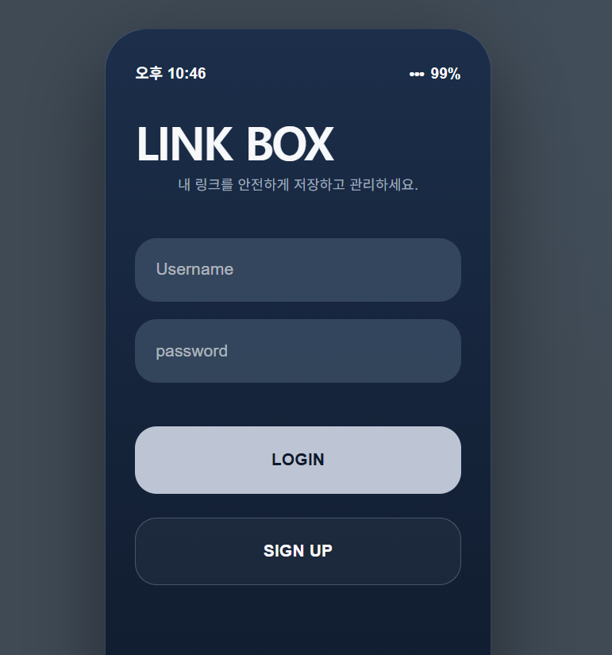

# 🔗 LinkBox React

기존 Spring Boot + Thymeleaf로 구현했던 **LinkBox를 React + REST API 구조로 재구성한 프로젝트**

기존 프로젝트에서는 Spring Boot가 화면과 서버 로직을 함께 담당했지만,  
이번 프로젝트에서는 **React와 Spring Boot를 분리하여 프론트엔드와 백엔드가 REST API를 통해 통신하는 구조**로 변경


---

## 🔄 기존 LinkBox와의 차이점

### 기존 LinkBox

> Spring Boot와 Thymeleaf를 사용하여 서버에서 HTML 화면을 생성하는 방식

```text
Browser
   ↓
Spring Boot Controller
   ↓
Service / Repository
   ↓
Database
   ↓
Thymeleaf
   ↓
HTML 반환
```

**Spring Boot가 데이터 처리뿐만 아니라 화면을 반환하는 역할까지 담당**

<br>

### 신규 LinkBox React

> React와 Spring Boot를 분리하여 프론트엔드와 백엔드 역할을 분리

```text
React
   ↓
fetch()
   ↓
REST API
   ↓
Spring Boot
   ↓
JPA Repository
   ↓
Database
```

**React** → 화면과 사용자 입력 담당  
**Spring Boot** → REST API와 데이터 처리 담당

---

## 🔌 REST API

React의 `fetch()`를 통해 Spring Boot REST API와 통신

| 기능 | Method | API |
| :--- | :---: | :--- |
| 로그인 | `POST` | `/api/login` |
| 회원가입 | `POST` | `/api/signup` |
| 로그아웃 | `POST` | `/api/logout` |
| 링크 조회 | `GET` | `/api/links` |
| 링크 등록 | `POST` | `/api/links` |
| 링크 삭제 | `POST` | `/api/links/{id}/delete` |

### Session / CORS

- `HttpSession`을 이용한 로그인 상태 관리
- `credentials: 'include'`를 사용하여 세션 쿠키 전달
- React(`5173`) ↔ Spring Boot(`8080`) 통신을 위한 CORS 설정

---

## 🖥️ 예시 화면

### Login

<p align="center">
  
</p>

---

## 📁 프로젝트 구조

```text
src
├── components
│   └── StatusBar.jsx
│
├── pages
│   ├── Login.jsx
│   ├── Signup.jsx
│   ├── Home.jsx
│   ├── Add.jsx
│   ├── Links.jsx
│   └── Delete.jsx
│
├── App.jsx
├── App.css
└── main.jsx
```

---

## 🛠 Tech Stack


---

> 💡 **참고:** 본 프로젝트는 생성형 AI(ChatGPT)를 개발 보조 도구로 활용하여 구현 및 학습을 진행
